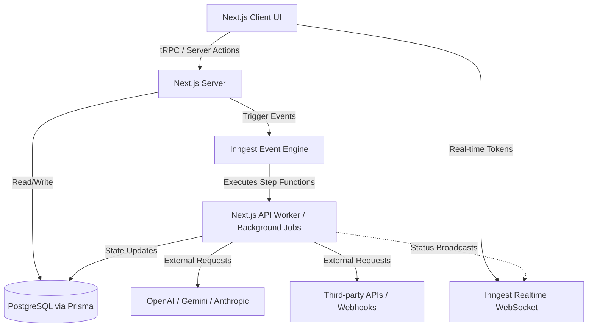

<div align="center">
  
  <h1>Nodebase</h1>
  <p><strong>The Ultimate Open-Source Workflow Automation Platform</strong></p>

[](https://nextjs.org/)
[](https://www.typescriptlang.org/)
[](https://www.inngest.com/)
[](https://reactflow.dev/)
[](https://www.prisma.io/)
[](https://trpc.io/)
[](https://developer.mozilla.org/en-US/docs/Web/Progressive_web_apps)

</div>

<br />


  <p align="center">
  
</p>


<br />

## 📖 Table of Contents

- [Overview](#-overview)
- [Key Features](#-key-features)
- [Use Cases](#-use-cases)
- [Architecture](#-architecture)
- [Technology Stack](#-technology-stack)
- [Getting Started](#-getting-started)
- [Roadmap](#-roadmap)
- [Security](#-security)
- [License](#-license)

---

## 🚀 Overview

**Nodebase** is a powerful, visual, and intelligent workflow automation platform. Designed to rival industry leaders like Zapier and Make, Nodebase allows you to visually connect your favorite apps, APIs, and AI models to automate your business processes seamlessly.

With an intuitive drag-and-drop canvas powered by `XYFlow`, robust background job execution orchestrated by `Inngest`, native integrations with the latest LLMs through the `Vercel AI SDK`, and full Progressive Web App (PWA) support, Nodebase represents the cutting edge of open-source automation.

## 💡 Use Cases

- **AI-Powered Customer Support**: Automatically trigger OpenAI to classify and draft responses to incoming emails or Slack messages.
- **Data Synchronization**: Listen for Stripe webhooks and instantly update your internal PostgreSQL CRM database.
- **Content Generation Pipelines**: Connect Google Forms to Anthropic Claude to generate personalized marketing copy based on survey responses.
- **Scheduled Reporting**: Automatically compile daily data and post it into Discord or Slack channels.

## ✨ Key Features

- **Visual Workflow Builder**: An interactive drag-and-drop canvas built with `@xyflow/react` for intuitive process modeling.
- **Robust Execution Engine**: Built on top of `Inngest` to guarantee execution, handle automatic retries, and manage distributed, long-running workflows without timeouts.
- **Native AI Integrations**: First-class nodes for Gemini, OpenAI, and Anthropic powered by the `@ai-sdk/core`.
- **Progressive Web App (PWA)**: Fully installable as a standalone app on desktop and mobile devices for a native-like experience.
- **Real-Time Visibility**: Real-time execution logs and node status updates streamed directly to the canvas using `Inngest Realtime`.
- **End-to-End Type Safety**: Seamless full-stack type safety from database to client using `tRPC` and `Zod`.
- **Modern Authentication**: Secure authentication via `@polar-sh/better-auth` supporting email/password and social logins (GitHub, Google).
- **Billing & Subscriptions**: Integrated with `@polar-sh/sdk` for seamless SaaS tier management.
- **Edge Ready & High Performance**: Powered by Next.js 16 (App Router) and Turbopack for lightning-fast speeds.

## 🏗 Architecture

Nodebase utilizes a modern, serverless-first architecture optimized for reliability and real-time feedback.



## 🛠️ Technology Stack

| Category           | Technologies                                                               |
| ------------------ | -------------------------------------------------------------------------- |
| **Framework**      | Next.js 16 (App Router), React 19                                          |
| **Styling**        | Tailwind CSS v4, shadcn/ui, Radix UI, Lucide React                         |
| **State & Data**   | Jotai (Client State), tRPC + TanStack Query (Data Fetching)                |
| **Execution**      | Inngest (Durable Execution, Job Queuing), Toposort (Graph Execution Logic) |
| **Database**       | PostgreSQL, Prisma ORM (`@prisma/client`)                                  |
| **Authentication** | Better Auth (`@polar-sh/better-auth`)                                      |
| **AI Integration** | Vercel AI SDK (`@ai-sdk/openai`, `@ai-sdk/anthropic`, `@ai-sdk/google`)    |

## 📂 Project Structure

Our monorepo-style structure emphasizes feature-based organization for scalability:

```text
nodebase/
├── src/
│   ├── app/                # Next.js 16 App Router pages, layouts, and API routes
│   ├── components/         # Reusable UI components (shadcn/ui, layout components)
│   ├── config/             # App-wide configuration (e.g., registry of node components)
│   ├── features/           # Feature-sliced modules (The core of the application)
│   │   ├── auth/           # Login/Signup forms and logic
│   │   ├── credentials/    # API key and secret management
│   │   ├── editor/         # The ReactFlow visual canvas and node logic
│   │   ├── executions/     # Execution tracking and executor implementations (AI, HTTP, etc.)
│   │   └── triggers/       # Webhook and Manual trigger implementations
│   ├── inngest/            # Inngest client, durable functions, and realtime channels
│   ├── trpc/               # tRPC routers, procedures, and client/server integrations
│   └── lib/                # Shared utility functions
├── prisma/                 # Prisma schema and migrations
└── next.config.ts          # Next.js configuration
```

## 🚀 Getting Started

### Prerequisites

- Node.js >= 20
- PostgreSQL database
- API Keys for desired AI providers (OpenAI, Gemini, Anthropic)
- Inngest Dev Server

### Installation

1. **Clone the repository:**

   ```bash
   git clone https://github.com/yourusername/nodebase.git
   cd nodebase
   ```

2. **Install dependencies:**

   ```bash
   npm install
   ```

3. **Set up your environment:**
   Copy the example environment variables and fill in your database and API credentials.

   ```bash
   cp .env.example .env
   ```

4. **Initialize the Database:**

   ```bash
   npx prisma generate
   npx prisma db push
   ```

5. **Start the Development Server:**
   Nodebase relies on a background execution engine. We use `mprocs` to run both the Next.js server and the Inngest CLI concurrently.

   ```bash
   npm run dev:all
   ```

6. Open [http://localhost:3000](http://localhost:3000) in your browser. The Inngest dev dashboard will be available at [http://localhost:8288](http://localhost:8288).

## 🗺️ Roadmap

We are constantly improving Nodebase. Here are a few things on our horizon:

- [ ] **Advanced Branching & Loops**: Add visual support for IF/ELSE conditions and loops within the canvas.
- [ ] **Cron Scheduler Triggers**: Allow workflows to be triggered on a set schedule (e.g., every day at 8 AM).
- [ ] **Custom Node Developer SDK**: Release a package enabling developers to easily build and share their own custom integration nodes.
- [ ] **Workflow Templates**: One-click installation of popular workflow templates directly from the dashboard.

## 🤝 Contributing

We welcome contributions from the community! Whether it's adding new nodes, squashing bugs, or improving documentation, your help is appreciated.

1. Fork the repository.
2. Create a new branch (`git checkout -b feature/amazing-feature`).
3. Commit your changes (`git commit -m 'Add amazing feature'`).
4. Push to the branch (`git push origin feature/amazing-feature`).
5. Open a Pull Request.

## 🔒 Security

Nodebase treats security as a first-class citizen:

- Credentials (API keys, tokens) are securely managed and not exposed to the client.
- `next.config.ts` incorporates security headers (`poweredByHeader: false`).
- Authentication uses secure HttpOnly cookies via Better Auth.
- Next.js Server Actions and tRPC routes perform rigorous input validation using `Zod`.

## 📄 License

This project is licensed under the MIT License. See the [LICENSE](LICENSE) file for details.
